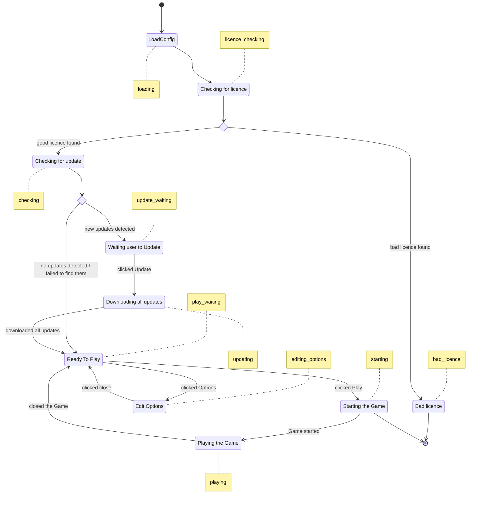

# Launcher

This electron application aim to create launcher for PSDK Games, it gives what's necessary to update and run the game!

## How it work

The launcher is a single page application that handle all the different view thanks to a state. The single page allows us to run animation over the elements of the page.

### State Machine

The state machine is handled inside `LauncherContext.tsx`, we have 10 states:

- `loading`: when the launcher loads its configuration
- `licence_checking` : when the launcher is checking for licence
- `bad_licence` : when the launcher finds a bad licence. The user cannot start the game.
- `checking`: when the launcher is checking for update
- `update_waiting`: when the launcher is waiting for the user to say "Yes I want to download updates"
- `updating`: when the launcher is downloading and applying updates
- `play_waiting`: when the launcher is waiting for the user to say "Yes I want to play"
- `starting`: when the launcher is starting the game
- `playing` : when the launcher is playing the game
- `editing_options`: when the launcher let user edit game options

Here's the state diagram:

> Note: To see the diagram please install the vscode extension `bierner.markdown-mermaid`.  
> You might need to re-open preview.
