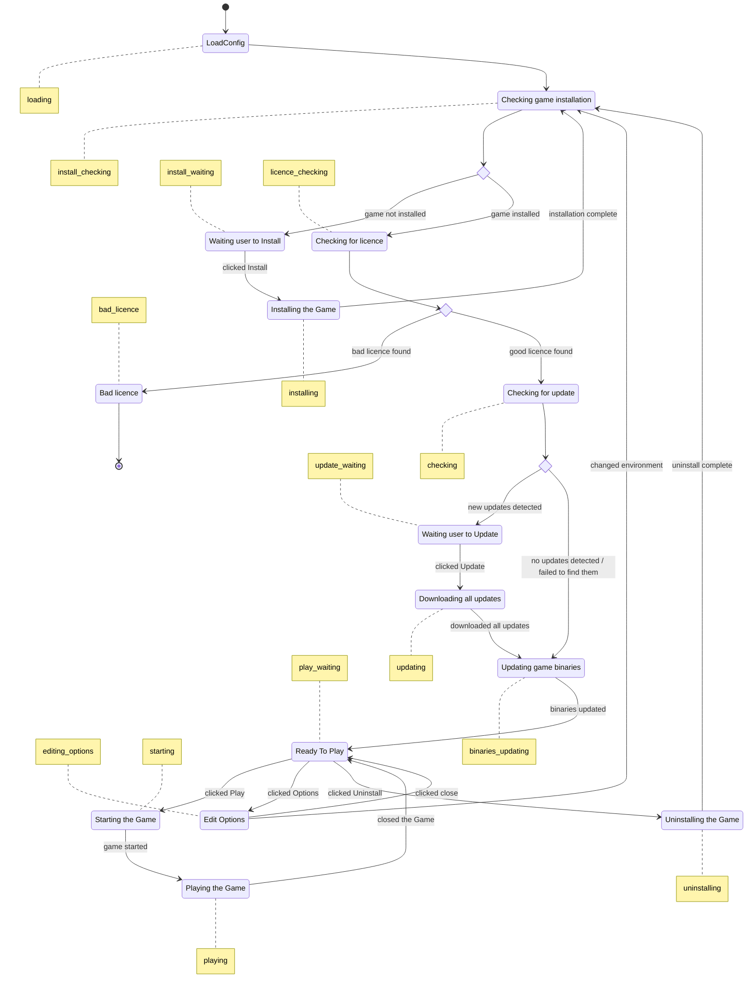

# Launcher

This electron application aims to create a launcher for PSDK Games, it gives what's necessary to update and run the game.

## How it work

The launcher is a single page application that handles all the different views thanks to a state machine. The single page allows the launcher to run animations over the elements of the page.

### State Machine

The state machine is handled inside `LauncherContext.tsx`, it has 15 states:

- `loading`: when the launcher loads its configuration
- `install_checking`: when the launcher checks whether the game is installed
- `install_waiting`: when the launcher waits for the user to install the game
- `installing`: when the launcher installs the game
- `licence_checking` : when the launcher is checking for licence
- `bad_licence` : when the launcher finds a bad licence. The user cannot start the game.
- `checking`: when the launcher is checking for update
- `update_waiting`: when the launcher is waiting for the user to say "Yes I want to download updates"
- `updating`: when the launcher is downloading and applying updates
- `binaries_updating`: when the launcher is updating its game binaries
- `play_waiting`: when the launcher is waiting for the user to say "Yes I want to play"
- `starting`: when the launcher is starting the game
- `playing` : when the launcher is playing the game
- `editing_options`: when the launcher lets the user edit game options
- `uninstalling`: when the launcher uninstalls the game

Here's the state diagram:

```mermaid
stateDiagram-v2

LoadConfig: LoadConfig
note right of LoadConfig: loading

CheckInstall: Checking game installation
note right of CheckInstall: install_checking

state game_installed <<choice>>

InstallMode: Waiting user to Install
note left of InstallMode: install_waiting

InstallGame: Installing the Game
note right of InstallGame: installing

CheckLicence: Checking for licence
note left of CheckLicence: licence_checking

BadLicence: Bad licence
note left of BadLicence: bad_licence

state no_licence <<choice>>

CheckUpdate: Checking for update
note right of CheckUpdate: checking

state any_update <<choice>>

PlayMode: Ready To Play
note left of PlayMode: play_waiting

OptionMode: Edit Options
note left of OptionMode: editing_options

StartGame: Starting the Game
note left of StartGame: starting

UpdateMode: Waiting user to Update
note left of UpdateMode: update_waiting

DlAllUpdates: Downloading all updates
note right of DlAllUpdates: updating

UpdateBinaries: Updating game binaries
note right of UpdateBinaries: binaries_updating

PlayGame: Playing the Game
note right of PlayGame: playing

UninstallGame: Uninstalling the Game
note right of UninstallGame: uninstalling

[*] --> LoadConfig
LoadConfig --> CheckInstall
CheckInstall --> game_installed
game_installed --> InstallMode: game not installed
game_installed --> CheckLicence: game installed
InstallMode --> InstallGame: clicked Install
InstallGame --> CheckInstall: installation complete
CheckLicence --> no_licence
no_licence --> BadLicence: bad licence found
no_licence --> CheckUpdate: good licence found
BadLicence --> [*]
CheckUpdate --> any_update
any_update --> UpdateMode: new updates detected
any_update --> UpdateBinaries: no updates detected / failed to find them
UpdateMode --> DlAllUpdates: clicked Update
DlAllUpdates --> UpdateBinaries: downloaded all updates
UpdateBinaries --> PlayMode: binaries updated
PlayMode --> StartGame: clicked Play
PlayMode --> OptionMode: clicked Options
OptionMode --> PlayMode: clicked close
OptionMode --> CheckInstall: changed environment
PlayMode --> UninstallGame: clicked Uninstall
UninstallGame --> CheckInstall: uninstall complete
StartGame --> PlayGame: game started
PlayGame --> PlayMode: closed the Game
```

> Note: To see the diagram please install the vscode extension `bierner.markdown-mermaid`.
> You might need to re-open preview.
